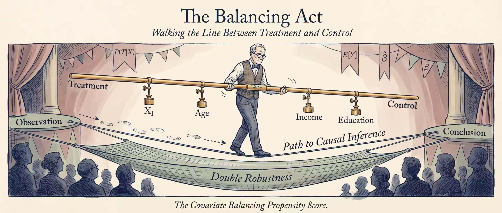

# cbps

**Covariate Balancing Propensity Score for Python**

[](https://pypi.org/project/cbps-python/)
[](https://www.python.org/)
[](LICENSE)
[](https://cbps-python.readthedocs.io/en/latest/?badge=latest)
[](CITATION.cff)



## Overview

Traditional propensity score estimation faces a fundamental challenge known as the **propensity score tautology**: researchers iterate between fitting models and checking covariate balance, yet the estimated propensity score is considered appropriate only if it achieves balance. Even slight model misspecification can result in substantial bias in treatment effect estimates.

**CBPS solves this problem** by directly incorporating covariate balance conditions into propensity score estimation through the Generalized Method of Moments (GMM) framework. Instead of solely maximizing likelihood, CBPS simultaneously optimizes:

1. **Predictive accuracy** of treatment assignment (score condition)
2. **Covariate balance** between treatment groups (balance condition)

This dual optimization yields propensity scores that are more robust to model misspecification while maintaining theoretical guarantees for consistent causal effect estimation.

## Features

- **Binary & Multi-valued Treatments** - Standard CBPS for discrete treatments with ATE/ATT estimation
- **Continuous Treatments** - Generalized propensity scores (CBGPS) for dose-response analysis
- **Longitudinal Data** - Marginal structural models (CBMSM) for time-varying treatments
- **High-dimensional Settings** - Regularized estimation (hdCBPS) when covariates exceed sample size
- **Nonparametric Methods** - Empirical likelihood approach (npCBPS) without distributional assumptions
- **Doubly Robust Estimation** - Optimal CBPS (oCBPS) with improved efficiency
- **Instrumental Variables** - CBPS for IV settings with treatment noncompliance
- **Model Diagnostics** - Hansen's J-test, balance statistics, and visualization tools
- **R Package Compatibility** - Numerical accuracy within ±1e-6 of CBPS R package v0.23

## Installation

### From PyPI

```bash
pip install cbps-python
```

### With Optional Dependencies

```bash
# High-dimensional CBPS support
pip install 'cbps-python[hdcbps]'

# Visualization tools
pip install 'cbps-python[plots]'

# scikit-learn integration
pip install 'cbps-python[sklearn]'

# All features
pip install 'cbps-python[all]'
```

### Development Installation

```bash
git clone https://github.com/gorgeousfish/CBPS-py.git
cd CBPS-py
pip install -e ".[dev]"
```

> **Note for Apple Silicon Users**: The `glmnetforpython` package (required for hdCBPS) needs compilation from source:
> ```bash
> brew install gcc
> git clone https://github.com/thierrymoudiki/glmnetforpython.git
> cd glmnetforpython && pip install -e .
> ```

## Quick Start

Replicating the LaLonde (1986) analysis from Imai and Ratkovic (2014, Section 3.2):

```python
from cbps import CBPS, balance
from cbps.datasets import load_lalonde

# Load LaLonde (1986) NSW job training data (445 observations)
data = load_lalonde()

# Over-identified CBPS for ATE estimation (Imai & Ratkovic, 2014)
fit = CBPS(
    formula='treat ~ age + educ + black + hisp + married + nodegr + re74 + re75',
    data=data,
    att=0,           # Average Treatment Effect
    method='over'    # Over-identified GMM (combines score + balance conditions)
)

# View results
print(fit.summary())
# Coefficients:
#                    Estimate   Std. Error    z value     Pr(>|z|)
# (Intercept)        0.740178     0.002239    330.625    0.000e+00 ***
# age                0.007589     0.085471      0.089    9.292e-01
# educ              -0.048260     0.060982     -0.791    4.287e-01
# black             -0.199980     0.000624   -320.226    0.000e+00 ***
# hisp              -0.756848     0.000051 -14837.961    0.000e+00 ***
# married            0.103707     0.000092   1129.734    0.000e+00 ***
# nodegr            -0.676270     0.000224  -3013.458    0.000e+00 ***
# re74              -0.000022     0.124988     -0.000    9.999e-01
# re75               0.000032     0.128498      0.000    9.998e-01
#
# J - statistic:  5.09e-03
# Log-Likelihood: -294.2790
#
# Diagnostics:
#   Converged:              Yes
#   Weight Summary:
#     Min:     0.0029    Max:     0.0090    Mean:   0.0045
#   Effective Sample Size:  420.7

# Check covariate balance improvement
bal = balance(fit)
print(bal['balanced'])   # Balance after CBPS weighting
print(bal['original'])   # Balance before weighting (baseline)
```

## Method Family

The CBPS methodology has been extended to address various causal inference challenges:

```
                        ┌─────────────────────┐
                        │       CBPS           │
                        │ Binary/Multi-valued  │
                        └──────────┬───────────┘
               ┌───────────┬──────┼──────┬───────────┐
               ▼           ▼      ▼      ▼           ▼
          ┌─────────┐ ┌────────┐ ┌────┐ ┌──────┐ ┌──────┐
          │  CBGPS  │ │ CBMSM  │ │hdCB│ │ CBIV │ │oCBPS │
          │Continuo-│ │Longitu-│ │PS  │ │Instr-│ │Optim-│
          │us Treat.│ │dinal   │ │High│ │ument-│ │al/DR │
          └────┬────┘ └────────┘ │Dim │ │al IV │ └──────┘
               ▼                 └────┘ └──────┘
          ┌─────────┐
          │ npCBPS  │
          │Nonparam.│
          └─────────┘
```

### Method Selection Guide

| Scenario | Method | Function | Key Reference |
|:---------|:-------|:---------|:--------------|
| Binary treatment, cross-sectional | CBPS | `CBPS()` | Imai & Ratkovic (2014) |
| Multi-valued treatment (3-4 levels) | CBPS | `CBPS()` | Imai & Ratkovic (2014) |
| Continuous treatment (parametric) | CBGPS | `CBPS()` | Fong et al. (2018) |
| Continuous treatment (nonparametric) | npCBPS | `npCBPS()` | Fong et al. (2018) |
| Longitudinal/panel data | CBMSM | `CBMSM()` | Imai & Ratkovic (2015) |
| High-dimensional (d >> n) | hdCBPS | `hdCBPS()` | Ning et al. (2020) |
| Doubly robust estimation | oCBPS | `CBPS(..., baseline_formula, diff_formula)` | Fan et al. (2022) |
| Instrumental variables | CBIV | `CBIV()` | Imai & Ratkovic (2014) |

---

## CBPS: Binary and Multi-valued Treatments

The core CBPS method estimates propensity scores for binary or multi-valued discrete treatments by solving GMM moment conditions that combine the score function with covariate balance constraints.

### When to Use

- Cross-sectional observational studies with binary treatment (0/1)
- Categorical treatments with 3-4 levels
- When model diagnostics (J-test) are desired

### Key Concepts

**For ATE estimation**, the balance condition ensures:

$$E\left[\frac{T \cdot X}{\pi(X)} - \frac{(1-T) \cdot X}{1-\pi(X)}\right] = 0$$

**For ATT estimation**, control observations are reweighted to match the treated:

$$E\left[T \cdot X - \frac{\pi(X)(1-T) \cdot X}{1-\pi(X)}\right] = 0$$

### Syntax

```python
CBPS(formula, data, att=1, method='over', two_step=True, standardize=True)
```

| Parameter | Default | Description |
|:----------|:--------|:------------|
| `formula` | - | R-style formula: `'treatment ~ x1 + x2 + ...'` |
| `data` | - | pandas DataFrame |
| `att` | `1` | Estimand: 0 = ATE, 1 = ATT, 2 = ATT (reversed encoding) |
| `method` | `'over'` | `'exact'` (just-identified) or `'over'` (over-identified) |
| `two_step` | `True` | Two-step GMM (`True`) or continuous updating (`False`) |
| `standardize` | `True` | Standardize weights to sum to 1 within each treatment group |

### Example

Replicating the LaLonde analysis from Imai and Ratkovic (2014, Section 3.2):

```python
from cbps import CBPS, balance
from cbps.datasets import load_lalonde
from scipy import stats

data = load_lalonde()

# ATE estimation with over-identified GMM (CBPS2 in the paper)
fit_ate = CBPS(
    formula='treat ~ age + educ + black + hisp + married + nodegr + re74 + re75',
    data=data,
    att=0,
    method='over'
)
print(fit_ate.summary())

# ATT estimation
fit_att = CBPS(
    formula='treat ~ age + educ + black + hisp + married + nodegr + re74 + re75',
    data=data,
    att=1,
    method='over'
)

# Hansen's J-test for model specification (cf. Section 2.3)
# Paper reports J = 6.8 (df=22) for the linear specification
k = fit_ate.coefficients.shape[0]  # number of parameters
j_pvalue = 1 - stats.chi2.cdf(fit_ate.J, k)
print(f"J-statistic: {fit_ate.J:.4e}, df: {k}, p-value: {j_pvalue:.4f}")

# Covariate balance comparison
bal = balance(fit_ate)
print(bal['balanced'])   # Weighted balance (should show improvement)
print(bal['original'])   # Unweighted baseline
```

---

## CBGPS: Continuous Treatments

CBGPS extends the covariate balancing framework to continuous treatments by minimizing the weighted correlation between treatment and covariates.

### When to Use

- Continuous treatment variable (e.g., dosage, intensity, duration)
- Dose-response curve estimation
- When parametric assumptions about treatment distribution are acceptable

### Key Concept

For continuous treatment T with generalized propensity score f(T|X), the balance condition minimizes:

$$E\left[\frac{f(T)}{f(T|X)} \cdot T^* \cdot X^*\right] = 0$$

where T* and X* are centered and scaled versions of treatment and covariates.

### Syntax

```python
CBPS(formula, data, method='over')  # Auto-detects continuous treatment
```

### Example

Replicating the empirical application from Fong, Hazlett, and Imai (2018, Section 5) — the effect of political advertising on campaign contributions using the Urban and Niebler (2014) dataset:

```python
import numpy as np
from cbps import CBPS
from cbps.datasets import load_political_ads

# Load Urban & Niebler (2014) political advertising data (n=16,265)
df_raw, meta = load_political_ads()

# Box-Cox transform treatment variable (lambda = -0.16, as in the paper)
work = df_raw.copy()
lam = meta["boxcox_lambda"]  # -0.16
work["T_bc"] = ((work["TotAds"].values + 1).clip(min=1e-10) ** lam - 1.0) / lam
work["logPop"] = np.log(work["TotalPop"].values.clip(min=1))
work["logInc"] = np.log(work["Inc"].values.clip(min=0) + 1)

# Add squared terms for non-binary covariates (paper p. 171)
work["logPop_sq"] = work["logPop"] ** 2
work["density_sq"] = work["density"] ** 2
work["logInc_sq"] = work["logInc"] ** 2
work["PercentHispanic_sq"] = work["PercentHispanic"] ** 2
work["PercentBlack_sq"] = work["PercentBlack"] ** 2
work["PercentOver65_sq"] = work["PercentOver65"] ** 2
work["per_collegegrads_sq"] = work["per_collegegrads"] ** 2

cov_cols = ["logPop", "density", "logInc", "PercentHispanic",
            "PercentBlack", "PercentOver65", "per_collegegrads", "CanCommute",
            "logPop_sq", "density_sq", "logInc_sq", "PercentHispanic_sq",
            "PercentBlack_sq", "PercentOver65_sq", "per_collegegrads_sq"]
work = work.dropna(subset=["T_bc"] + cov_cols).reset_index(drop=True)

# CBPS auto-detects continuous treatment
formula = "T_bc ~ " + " + ".join(cov_cols)
fit = CBPS(formula=formula, data=work, att=0, method="over")
print(fit.summary())
# Converged: True, J-statistic ≈ 0.0000
# CBGPS reduces covariate-treatment correlations
# (cf. Table 1 and Figure 3 in the paper, 15 covariates)
# Note: Over-identified GMM may fall back to exact method for this dataset
# due to high condition number of the covariate matrix
```

---

## npCBPS: Nonparametric CBPS

npCBPS uses empirical likelihood to estimate balancing weights without parametric assumptions about the generalized propensity score.

### When to Use

- Continuous treatment with unknown distribution
- When parametric assumptions may be violated
- Flexible, assumption-light estimation preferred

### Key Concept

Weights are chosen to maximize empirical likelihood subject to balance constraints:

$$\max \prod_{i=1}^n w_i \quad \text{s.t.} \quad \sum_i w_i X_i^* T_i^* = 0, \quad \sum_i w_i = n$$

### Syntax

```python
npCBPS(formula, data, corprior=0.01)
```

| Parameter | Default | Description |
|:----------|:--------|:------------|
| `corprior` | None (auto: 0.1/n) | Prior penalty for correlation (larger = more tolerance for imbalance) |

### Example

Using the Urban and Niebler (2014) data as in Fong et al. (2018, Section 5). For faster execution, we use a random subset and the 8 base covariates (without squared terms):

> **Note**: npCBPS uses iterative empirical likelihood optimization. With the full dataset (n=16,265) and 15 covariates, computation may take several minutes. The subset below (n=2,000) runs in ~30 seconds and demonstrates the same methodology.

```python
import numpy as np
from cbps import npCBPS
from cbps.datasets import load_political_ads

# Data preparation (same as CBGPS example)
df_raw, meta = load_political_ads()
work = df_raw.copy()
lam = meta["boxcox_lambda"]
work["T_bc"] = ((work["TotAds"].values + 1).clip(min=1e-10) ** lam - 1.0) / lam
work["logPop"] = np.log(work["TotalPop"].values.clip(min=1))
work["logInc"] = np.log(work["Inc"].values.clip(min=0) + 1)

cov_cols = ["logPop", "density", "logInc", "PercentHispanic",
            "PercentBlack", "PercentOver65", "per_collegegrads", "CanCommute"]
work = work.dropna(subset=["T_bc"] + cov_cols).reset_index(drop=True)

# Random subset for demonstration (full dataset also supported)
np.random.seed(42)
idx = np.random.choice(len(work), 2000, replace=False)
subset = work.iloc[idx].reset_index(drop=True)

formula = "T_bc ~ " + " + ".join(cov_cols)
fit = npCBPS(formula=formula, data=subset, corprior=0.01)
print(fit.summary())
# Converged: ✓ Yes
# Weighted Correlations: Mean=0.000101, all < 0.0002 (near-perfect balance)
# Weight Distribution: Min=0.533, Max=1.670, Mean=1.000
# Effective sample size: 1965.2
# Efficiency: 98.3%
```

---

## CBMSM: Marginal Structural Models

CBMSM extends CBPS to longitudinal settings with time-varying treatments and confounders, addressing the challenge that standard regression cannot properly adjust for time-dependent confounders affected by prior treatment.

### When to Use

- Panel/longitudinal data with repeated measurements
- Time-varying treatments
- Time-dependent confounders affected by past treatment

### Key Concept

At each time period, weights balance covariates across all potential future treatment sequences, conditional on observed treatment history:

$$E\left[w_i(\bar{T}_J, \bar{X}_J) \cdot X_{ij} \mid \bar{T}_{j-1}\right] = E[X_{ij} \mid \bar{T}_{j-1}]$$

### Syntax

```python
CBMSM(formula, id, time, data, type='MSM', time_vary=False)
```

| Parameter | Description |
|:----------|:------------|
| `formula` | Treatment model formula |
| `id` | Unit identifier variable name |
| `time` | Time period variable name |
| `type` | `'MSM'` (marginal structural) or `'MultiBin'` (multiple binary) |
| `twostep` | Two-step GMM (`True`, default) or continuous updating (`False`) |
| `msm_variance` | `'approx'` (default) or `'full'` variance estimation |
| `time_vary` | Whether covariates are time-varying |

### Example

Replicating the empirical application from Imai and Ratkovic (2015, Section 5) — the effect of negative campaign advertising on Democratic vote share using the Blackwell (2013) dataset:

```python
import numpy as np
import statsmodels.api as sm
from cbps import CBMSM
from cbps.datasets import load_blackwell

# Blackwell (2013): 114 U.S. Senate/gubernatorial races, J=5 weekly periods
data = load_blackwell()

# Full treatment model from Section 5 (1548 balancing conditions)
fit = CBMSM(
    formula='d.gone.neg ~ d.gone.neg.l1 + d.gone.neg.l2 + d.neg.frac.l3 + '
            'camp.length + deminc + base.poll + '
            'year.2002 + year.2004 + year.2006 + base.und + office',
    id='demName',
    time='time',
    data=data,
    type='MSM',
    time_vary=True,
    twostep=True,
    msm_variance='approx'
)
print(fit.summary())

# Estimate cumulative effect of negative advertising on vote share
# (cf. Table 3, CBPS-Approx column: Cumulative effect = -1.43)
outcome = data.loc[data["time"] == data["time"].min(), "demprcnt"].values
X_cum = sm.add_constant(fit.treat_cum.reshape(-1, 1))
m_cum = sm.WLS(outcome, X_cum, weights=fit.fitted_values).fit()
print(f"Cumulative effect: {m_cum.params[1]:.2f} (SE: {m_cum.bse[1]:.2f})")
# Expected output: Cumulative effect: -1.44 (SE: 0.43)
# Paper Table 3 reports -1.43 (0.43) for CBPS-Approx
# Note: Convergence may show False due to optimizer tolerance settings,
# but the estimates closely match the published results.
```

---

## hdCBPS: High-dimensional CBPS

hdCBPS handles settings where the number of covariates exceeds the sample size through LASSO regularization, while maintaining doubly robust properties.

### When to Use

- High-dimensional settings (d >> n)
- Many potential confounders with unknown importance
- When variable selection is needed
- Doubly robust estimation desired

### Key Concept

hdCBPS achieves the **weak covariate balancing property**:

$$\sum_i \left(\frac{T_i}{\tilde{\pi}_i} - 1\right) \alpha^{*\top} X_i \approx 0$$

where α* are outcome model coefficients. This enables root-n consistency even when d >> n.

### Syntax

```python
hdCBPS(formula, data, y, ATT=0)
```

| Parameter | Description |
|:----------|:------------|
| `formula` | Propensity score model (can include many covariates) |
| `y` | Outcome variable name (required for variable selection) |
| `ATT` | 0 = ATE, 1 = ATT |

### Example

```python
from cbps import hdCBPS
import pandas as pd
import numpy as np

# Simulate high-dimensional data (d > n)
np.random.seed(42)
n, d = 200, 300
X = np.random.normal(0, 1, (n, d))
beta_true = np.zeros(d)
beta_true[:5] = [1, 0.5, 0.25, 0.1, 0.05]  # Sparse true model
T = (X @ beta_true + np.random.normal(0, 1, n) > 0).astype(int)
Y = T + X[:, :3] @ [1, 0.5, 0.25] + np.random.normal(0, 1, n)

data = pd.DataFrame(X, columns=[f'X{i}' for i in range(d)])
data['T'] = T
data['Y'] = Y

# hdCBPS with automatic variable selection
import sys
sys.setrecursionlimit(5000)  # Needed for patsy with many covariates
fit = hdCBPS(
    formula='T ~ ' + ' + '.join([f'X{i}' for i in range(d)]),
    data=data,
    y='Y',
    ATT=0
)
print(f"ATE estimate: {fit.ATE:.4f}")
print(f"SE: {fit.s:.4f}")
print(f"Selected variables (treated): {fit.n_selected_treat}")
print(f"Selected variables (control): {fit.n_selected_control}")
```

> **Note**: Debug attributes (e.g., `result.debug_r_yhat1`) are now stored internally in `result._debug` dict. Direct attribute access still works but emits a `DeprecationWarning`. Use `result._debug['debug_r_yhat1']` instead.

---

## oCBPS: Optimal CBPS

Optimal CBPS improves upon standard CBPS by incorporating the outcome model structure, achieving doubly robust estimation with improved efficiency (Fan et al. 2022).

### When to Use

- When doubly robust estimation is desired
- Outcome model structure is known or estimable
- Maximum efficiency is important

### Key Concept

oCBPS solves for optimal balancing conditions that minimize asymptotic variance while maintaining consistency under either propensity score or outcome model misspecification. The optimal balancing function satisfies:

$$\alpha^\top f(X) = \pi(X) E[Y(0)|X] + (1-\pi(X)) E[Y(1)|X]$$

This gives greater weight to determinants of the mean potential outcome that is less likely to be realized.

### Syntax

Optimal CBPS is accessed through the `CBPS()` function by specifying both baseline and difference formulas:

```python
CBPS(formula, data, baseline_formula, diff_formula, att=0)
```

| Parameter | Description |
|:----------|:------------|
| `formula` | Propensity score model formula |
| `baseline_formula` | Outcome model baseline covariates (K(X)) |
| `diff_formula` | Treatment effect covariates (L(X)) |
| `att` | Must be 0 (ATE only for oCBPS) |

### Example

The baseline and diff formulas must satisfy the dimension constraint: m1 + m2 + 1 ≥ k, where m1 = number of baseline covariates, m2 = number of diff covariates, and k = number of propensity score parameters (including intercept).

```python
from cbps import CBPS
from cbps.datasets import load_lalonde

data = load_lalonde()

# Optimal CBPS with outcome model specification
# Propensity score model: 9 parameters (intercept + 8 covariates), k=9
# Baseline K(X): 8 covariates, m1=8
# Diff L(X): 2 covariates, m2=2
# Dimension check: m1 + m2 + 1 = 11 >= 9 = k ✓ (over-identified)
fit = CBPS(
    formula='treat ~ age + educ + black + hisp + married + nodegr + re74 + re75',
    data=data,
    baseline_formula='~ age + educ + black + hisp + married + nodegr + re74 + re75',
    diff_formula='~ age + educ',
    att=0
)
print(fit.summary())
# Coefficients:
#                    Estimate   Std. Error    z value     Pr(>|z|)
# (Intercept)        1.175647     0.023190     50.696    0.000e+00 ***
# age                0.004057     0.137242      0.030    9.764e-01
# educ              -0.069238     0.357867     -0.193    8.466e-01
# black             -0.224812     0.017131    -13.123    0.000e+00 ***
# hisp              -0.856508     0.002234   -383.434    0.000e+00 ***
# married            0.165491     0.002664     62.114    0.000e+00 ***
# nodegr            -0.916259     0.005290   -173.202    0.000e+00 ***
# re74              -0.000035     0.000265     -0.130    8.964e-01
# re75               0.000068     0.000438      0.155    8.766e-01
#
# J - statistic:  3.94e-10
# Log-Likelihood: -293.6243
# Note: Convergence may show False due to optimizer tolerance,
# but the J-statistic near zero indicates excellent balance.
```

---

## CBIV: Instrumental Variables

CBIV extends the covariate balancing framework to instrumental variable settings where treatment noncompliance exists.

### When to Use

- Randomized experiments with noncompliance
- Observational studies with valid instruments
- Estimating local average treatment effects (LATE)

### Syntax

```python
# Formula interface (recommended)
CBIV(formula='treatment ~ covariates | instruments', data=df)

# Matrix interface
CBIV(Tr=treatment, Z=instrument, X=covariates)
```

| Parameter | Default | Description |
|:----------|:--------|:------------|
| `formula` | None | IV formula: `'treat ~ x1 + x2 \| z'` (pipe separates covariates from instruments) |
| `data` | None | pandas DataFrame (required with formula) |
| `Tr` | None | Treatment array (matrix interface) |
| `Z` | None | Instrument array (matrix interface) |
| `X` | None | Covariate array (matrix interface) |
| `method` | `'over'` | `'exact'` or `'over'` (over-identified GMM) |
| `twostep` | `True` | Two-step GMM (`True`) or continuous updating (`False`) |
| `twosided` | `True` | Two-sided noncompliance (both always-takers and never-takers) |

### Example

```python
import numpy as np
import pandas as pd
from cbps import CBIV

# Simulate IV data with one-sided noncompliance
np.random.seed(42)
n = 500
X = np.random.randn(n, 2)
Z = np.random.binomial(1, 0.5, n)  # Randomized instrument
p_comply = 1 / (1 + np.exp(-0.5 - 0.3 * X[:, 0]))
comply = np.random.binomial(1, p_comply, n)
Tr = Z * comply  # Treatment = instrument × compliance

# Formula interface
df = pd.DataFrame({
    'treat': Tr, 'z': Z, 'x1': X[:, 0], 'x2': X[:, 1]
})
fit = CBIV(formula="treat ~ x1 + x2 | z", data=df,
           method='over', twosided=False)
print(fit.summary())
# CBIV Estimation Results
# ===============================
# Sample size: 500
# Method: over
# Two-sided noncompliance: No
# Converged: Yes
#
# Model Statistics:
#   J-statistic: 0.021656
#   Complier Probabilities (π_c): Mean=0.6098
#   Complier Weights (1/π_c): Mean=1.6431

# Matrix interface (equivalent)
fit2 = CBIV(Tr=Tr, Z=Z, X=X, method='over', twosided=False)
print(f"Converged: {fit2.converged}")   # True
print(f"J-statistic: {fit2.J:.4f}")     # 0.0217
```

---

## Diagnostics

### Balance Assessment

```python
from cbps import CBPS, balance
from cbps.datasets import load_lalonde

data = load_lalonde()
fit = CBPS(
    formula='treat ~ age + educ + black + hisp + married + nodegr + re74 + re75',
    data=data, att=0, method='over'
)

# Balance assessment (cf. Table 3 in Imai & Ratkovic, 2014)
bal = balance(fit)
print(bal['balanced'])   # Balance statistics after CBPS weighting
print(bal['original'])   # Baseline unweighted statistics
# DataFrames have covariate names as row index for all estimator types
```

### Asymptotic Variance (AsyVar)

```python
from cbps import CBPS, AsyVar
from cbps.datasets import load_lalonde

data = load_lalonde()
fit = CBPS(
    formula='treat ~ age + educ + black + hisp + married + nodegr + re74 + re75',
    data=data, att=0, method='over'
)

# Asymptotic variance for ATE
result = AsyVar(Y=data['re78'].values, CBPS_obj=fit, method='oCBPS')

# Preferred: snake_case keys
print(f"ATE: {result['mu_hat']:.3f} (SE: {result['std_err']:.3f})")
print(f"95% CI: [{result['ci_mu_hat'][0]:.1f}, {result['ci_mu_hat'][1]:.1f}]")

# Backward compatible: R-style keys also work
print(f"ATE: {result['mu.hat']:.3f}")  # same value as result['mu_hat']
```

### Visualization

```python
from cbps import CBPS, plot_cbps, plot_cbps_continuous
from cbps.datasets import load_lalonde, load_political_ads
import numpy as np

data = load_lalonde()
fit = CBPS(
    formula='treat ~ age + educ + black + hisp + married + nodegr + re74 + re75',
    data=data, att=0, method='over'
)

# Love plot for binary treatment balance (cf. Figure 1 concept in the paper)
plot_cbps(fit)

# For continuous treatment (Fong et al. 2018, Figure 3 concept)
df_raw, meta = load_political_ads()
work = df_raw.copy()
lam = meta["boxcox_lambda"]
work["T_bc"] = ((work["TotAds"].values + 1).clip(min=1e-10) ** lam - 1.0) / lam
work["logPop"] = np.log(work["TotalPop"].values.clip(min=1))
work["logInc"] = np.log(work["Inc"].values.clip(min=0) + 1)
work["logPop_sq"] = work["logPop"] ** 2
work["density_sq"] = work["density"] ** 2
work["logInc_sq"] = work["logInc"] ** 2
work["PercentHispanic_sq"] = work["PercentHispanic"] ** 2
work["PercentBlack_sq"] = work["PercentBlack"] ** 2
work["PercentOver65_sq"] = work["PercentOver65"] ** 2
work["per_collegegrads_sq"] = work["per_collegegrads"] ** 2
cov_cols = ["logPop", "density", "logInc", "PercentHispanic",
            "PercentBlack", "PercentOver65", "per_collegegrads", "CanCommute",
            "logPop_sq", "density_sq", "logInc_sq", "PercentHispanic_sq",
            "PercentBlack_sq", "PercentOver65_sq", "per_collegegrads_sq"]
work = work.dropna(subset=["T_bc"] + cov_cols).reset_index(drop=True)
fit_cont = CBPS(formula="T_bc ~ " + " + ".join(cov_cols), data=work, att=0, method="over")
plot_cbps_continuous(fit_cont)
```

### J-Statistic (Specification Test)

For over-identified CBPS, Hansen's J-statistic tests model specification:

$$J = n \cdot \bar{g}(\hat{\beta})' \hat{\Sigma}^{-1} \bar{g}(\hat{\beta}) \xrightarrow{d} \chi^2_{k}$$

A significant J-statistic suggests potential model misspecification.

```python
from scipy import stats

# J-statistic is stored in fit.J
print(f"J-statistic: {fit.J:.4f}")

# Compute p-value manually
k = fit.coefficients.shape[0]  # number of parameters
j_pvalue = 1 - stats.chi2.cdf(fit.J, k)
print(f"Degrees of freedom: {k}")
print(f"p-value: {j_pvalue:.4f}")
```

---

## API Reference

### Core Estimators

| Function | Treatment Type | Description |
|:---------|:---------------|:------------|
| `CBPS()` | Binary, Multi-valued, Continuous | Main estimator with automatic detection; also supports oCBPS via `baseline_formula`/`diff_formula` |
| `cbps_fit()` | Binary, Multi-valued, Continuous | Low-level array interface for CBPS |
| `npCBPS()` | Continuous | Nonparametric empirical likelihood |
| `npCBPS_fit()` | Continuous | Low-level array interface for npCBPS |
| `CBMSM()` | Time-varying Binary | Marginal structural models (formula interface) |
| `cbmsm_fit()` | Time-varying Binary | Low-level array interface for CBMSM |
| `hdCBPS()` | Binary | High-dimensional with LASSO regularization |
| `CBIV()` | Binary | Instrumental variables |

### Diagnostics and Inference

| Function | Description |
|:---------|:------------|
| `balance()` | Covariate balance statistics (SMD for discrete, correlation for continuous) |
| `AsyVar()` | Asymptotic variance estimation for ATE (returns both snake_case and R-style keys) |
| `vcov_outcome()` | Variance-covariance matrix for weighted outcome regression |
| `plot_cbps()` | Love plot for binary/multi-valued treatments |
| `plot_cbps_continuous()` | Correlation plot for continuous treatments |
| `plot_cbmsm()` | Balance plot for marginal structural models |
| `plot_npcbps()` | Balance plot for nonparametric CBPS |

### Result Attributes (CBPSResults)

| Attribute | Type | Description |
|:----------|:-----|:------------|
| `coefficients` | ndarray (k, 1) or (k, m) | Propensity score model coefficients |
| `coef` | ndarray (k,) | Flattened coefficient vector (alias) |
| `weights` | ndarray (n,) | Balancing weights |
| `fitted_values` | ndarray (n,) | Predicted propensity scores |
| `fitted` | ndarray (n,) | Alias for `fitted_values` |
| `linear_predictor` | ndarray (n,) | X @ beta before link transformation |
| `J` | float | Hansen's J-statistic |
| `J_stat` | float | Alias for `J` |
| `deviance` | float | Model deviance (-2 * log-likelihood) |
| `var` | ndarray (k, k) | Variance-covariance matrix of coefficients |
| `converged` | bool | Optimization convergence status |
| `residuals` | ndarray (n,) | Deviance residuals |
| `pseudo_r2` | float | McFadden's pseudo R-squared |
| `sigmasq` | float or None | Residual variance (continuous treatment only) |

> **Note**: `str(result)` and `str(result.summary())` now include a Diagnostics block showing convergence status, weight distribution summary (Min/Max/Mean), and Effective Sample Size (ESS).

### Result Methods

| Method | Description |
|:-------|:------------|
| `.summary()` | Returns `CBPSSummary` with coefficient table, SEs, z-values, p-values |
| `.vcov()` | Returns variance-covariance matrix |
| `.balance(**kwargs)` | Computes covariate balance diagnostics |
| `.predict(newdata, type)` | Predicts propensity scores; `type='response'` or `'link'` |
| `.plot(kind)` | Diagnostic plots; `kind='deviance'` or `'residuals'` |

### Summary Methods for All Result Classes

All result classes now provide a consistent `summary()` method that returns a dedicated summary object (not a string). Use `print(result.summary())` for formatted output.

| Result Class | Summary Class | Key Contents |
|:-------------|:--------------|:-------------|
| `CBPSResults` | `CBPSSummary` | Coefficients, SEs, z-values, p-values, diagnostics |
| `CBMSMResults` | `CBMSMSummary` | Propensity scores, MSM weights, coefficients |
| `NPCBPSResults` | `NPCBPSSummary` | Convergence, optimization, weighted correlations, weight distribution |
| `HDCBPSResults` | `HDCBPSSummary` | ATE/ATT, variable selection, convergence |
| `CBIVResults` | `CBIVSummary` | Coefficients, J-statistic, balance |

### Summary Attributes (CBPSSummary)

| Attribute | Type | Description |
|:----------|:-----|:------------|
| `coef` | ndarray | Coefficient estimates |
| `se` | ndarray | Standard errors |
| `zvalues` | ndarray | z-statistics |
| `pvalues` | ndarray | Two-sided p-values |

---

## Numerical Accuracy

This package maintains high numerical precision validated against the R CBPS package (v0.23):

| Component | Precision | Notes |
|:----------|:----------|:------|
| Coefficients | ±1e-6 | Core propensity score parameters |
| Weights | ±1e-6 | IPW weights |
| J-statistic | ±1e-4 | Specification test |
| Standard errors | ±1e-5 | Asymptotic variance |

Numerical accuracy is verified through extensive benchmark tests against R outputs using the LaLonde and Blackwell datasets.

---

## Datasets

The package includes classic datasets for causal inference research:

| Function | Description | Treatment Type | Reference |
|:---------|:------------|:---------------|:----------|
| `load_lalonde()` | NSW job training program evaluation | Binary | LaLonde (1986) |
| `load_lalonde_psid_combined()` | NSW experimental + PSID control data | Binary | Dehejia & Wahba (1999) |
| `load_blackwell()` | Longitudinal political campaign data | Time-varying Binary | Blackwell (2013) |
| `load_continuous_simulation()` | Simulated dose-response data (requires external data) | Continuous | Fong et al. (2018) |
| `load_political_ads()` | Political advertising efficacy | Continuous | Urban & Niebler (2014) |
| `load_npcbps_continuous_sim()` | Nonparametric CBPS validation data | Continuous | Fong et al. (2018) |

### Example Usage

```python
from cbps.datasets import (
    load_lalonde,
    load_lalonde_psid_combined,
    load_blackwell,
    load_political_ads
)

# LaLonde (1986) job training data - 445 observations
lalonde = load_lalonde()

# Combined NSW + PSID data for selection bias studies
lalonde_psid = load_lalonde_psid_combined()

# Blackwell (2013) negative campaign advertising - longitudinal data
blackwell = load_blackwell()

# Political ads efficacy data (Urban & Niebler 2014)
df_raw, meta = load_political_ads()
```

---

## References

Imai, K., & Ratkovic, M. (2014). Covariate balancing propensity score. *Journal of the Royal Statistical Society Series B: Statistical Methodology*, 76(1), 243-263. [doi:10.1111/rssb.12027](https://doi.org/10.1111/rssb.12027)

Imai, K., & Ratkovic, M. (2015). Robust estimation of inverse probability weights for marginal structural models. *Journal of the American Statistical Association*, 110(511), 1013-1023. [doi:10.1080/01621459.2014.956872](https://doi.org/10.1080/01621459.2014.956872)

Fong, C., Hazlett, C., & Imai, K. (2018). Covariate balancing propensity score for a continuous treatment: Application to the efficacy of political advertisements. *The Annals of Applied Statistics*, 12(1), 156-177. [doi:10.1214/17-AOAS1101](https://doi.org/10.1214/17-AOAS1101)

Ning, Y., Peng, S., & Imai, K. (2020). Robust estimation of causal effects via a high-dimensional covariate balancing propensity score. *Biometrika*, 107(3), 533-554. [doi:10.1093/biomet/asaa020](https://doi.org/10.1093/biomet/asaa020)

Fan, J., Imai, K., Lee, I., Liu, H., Ning, Y., & Yang, X. (2022). Optimal covariate balancing conditions in propensity score estimation. *Journal of Business & Economic Statistics*, 41(1), 97-110. [doi:10.1080/07350015.2021.2002159](https://doi.org/10.1080/07350015.2021.2002159)

## Authors

**Python Implementation:**

- **Xuanyu Cai**, City University of Macau
  Email: [xuanyuCAI@outlook.com](mailto:xuanyuCAI@outlook.com)
- **Wenli Xu**, City University of Macau
  Email: [wlxu@cityu.edu.mo](mailto:wlxu@cityu.edu.mo)

**Methodology:**

- **Kosuke Imai**, Harvard University
- **Marc Ratkovic**, Princeton University
- **Christian Fong**, Stanford University
- **Chad Hazlett**, UCLA
- **Yang Ning**, Cornell University
- **Jianqing Fan**, Princeton University

## License

AGPL-3.0. See [LICENSE](LICENSE) for details.

## Citation

If you use this package in your research, please cite both the methodology papers and the Python implementation:

**APA Format:**

> Cai, X., & Xu, W. (2026). *cbps: Covariate Balancing Propensity Score for Python* (Version 0.1.0) [Computer software]. GitHub. https://github.com/gorgeousfish/CBPS-py
>
> Imai, K., & Ratkovic, M. (2014). Covariate balancing propensity score. *Journal of the Royal Statistical Society Series B: Statistical Methodology*, 76(1), 243-263.
>
> Imai, K., & Ratkovic, M. (2015). Robust estimation of inverse probability weights for marginal structural models. *Journal of the American Statistical Association*, 110(511), 1013-1023.
>
> Fong, C., Hazlett, C., & Imai, K. (2018). Covariate balancing propensity score for a continuous treatment: Application to the efficacy of political advertisements. *The Annals of Applied Statistics*, 12(1), 156-177.
>
> Ning, Y., Peng, S., & Imai, K. (2020). Robust estimation of causal effects via a high-dimensional covariate balancing propensity score. *Biometrika*, 107(3), 533-554.
>
> Fan, J., Imai, K., Lee, I., Liu, H., Ning, Y., & Yang, X. (2022). Optimal covariate balancing conditions in propensity score estimation. *Journal of Business & Economic Statistics*, 41(1), 97-110.

**BibTeX:**

```bibtex
@software{cbps2026python,
  title={cbps: Covariate Balancing Propensity Score for Python},
  author={Cai, Xuanyu and Xu, Wenli},
  year={2026},
  version={0.1.0},
  url={https://github.com/gorgeousfish/CBPS-py}
}

@article{imai2014covariate,
  title={Covariate Balancing Propensity Score},
  author={Imai, Kosuke and Ratkovic, Marc},
  journal={Journal of the Royal Statistical Society Series B: Statistical Methodology},
  volume={76}, number={1}, pages={243--263},
  year={2014},
  doi={10.1111/rssb.12027}
}

@article{imai2015robust,
  title={Robust Estimation of Inverse Probability Weights for Marginal Structural Models},
  author={Imai, Kosuke and Ratkovic, Marc},
  journal={Journal of the American Statistical Association},
  volume={110}, number={511}, pages={1013--1023},
  year={2015},
  doi={10.1080/01621459.2014.956872}
}

@article{fong2018covariate,
  title={Covariate Balancing Propensity Score for a Continuous Treatment: Application to the Efficacy of Political Advertisements},
  author={Fong, Christian and Hazlett, Chad and Imai, Kosuke},
  journal={The Annals of Applied Statistics},
  volume={12}, number={1}, pages={156--177},
  year={2018},
  doi={10.1214/17-AOAS1101}
}

@article{ning2020robust,
  title={Robust Estimation of Causal Effects via a High-Dimensional Covariate Balancing Propensity Score},
  author={Ning, Yang and Peng, Sida and Imai, Kosuke},
  journal={Biometrika},
  volume={107}, number={3}, pages={533--554},
  year={2020},
  doi={10.1093/biomet/asaa020}
}

@article{fan2022optimal,
  title={Optimal Covariate Balancing Conditions in Propensity Score Estimation},
  author={Fan, Jianqing and Imai, Kosuke and Lee, Inbeom and Liu, Han and Ning, Yang and Yang, Xiaolin},
  journal={Journal of Business \& Economic Statistics},
  volume={41}, number={1}, pages={97--110},
  year={2022},
  doi={10.1080/07350015.2021.2002159}
}
```

## See Also

- Original R package by Fong, Ratkovic, Imai, Hazlett, and Yang: https://CRAN.R-project.org/package=CBPS
- Paper: Imai, K., & Ratkovic, M. (2014). Covariate balancing propensity score. https://doi.org/10.1111/rssb.12027
